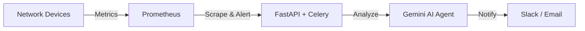

---

### 👋 About me

🎓 Junior at **VNUHCM-UIT** — Computer Networks & Communications
🚀 Building a **Cloud-Based AI Agent System** for network incident detection & alerting
🛠️ Working with `AWS` · `Terraform` · `Prometheus` · `FastAPI` · `Gemini`
📡 Into IaC, observability, and turning raw infra noise into signal
🌱 Currently exploring: LLM-powered ops agents & cost-aware cloud architecture

---

### 🧰 Tech Stack

  

---

### 📌 Pinned Projects

<table>
<tr>
<td width="50%" valign="top">

**[☁️ Cloud-Based AI Agent System](https://github.com/Benjaminnhnn/Cloud-Based-AI-Agent-System-for-Network-Incident-Detection-Alerting)**

Network incident detection & alerting on AWS — Capstone project.

`Python` `FastAPI` `Celery` `AWS` `Terraform` `Ansible` `Prometheus` `Gemini`

</td>
<td width="50%" valign="top">

**[📚 BookVN](https://github.com/Lequangtien165)**

Android reading app with Firebase Auth & social features.

`Java` `Android` `Firebase`

</td>
</tr>
</table>

---

### 📊 GitHub Stats

  
  

  

---

> *"If it hurts, do it more often — and automate it."*
> — Jez Humble

### 🔗 Connect with me

